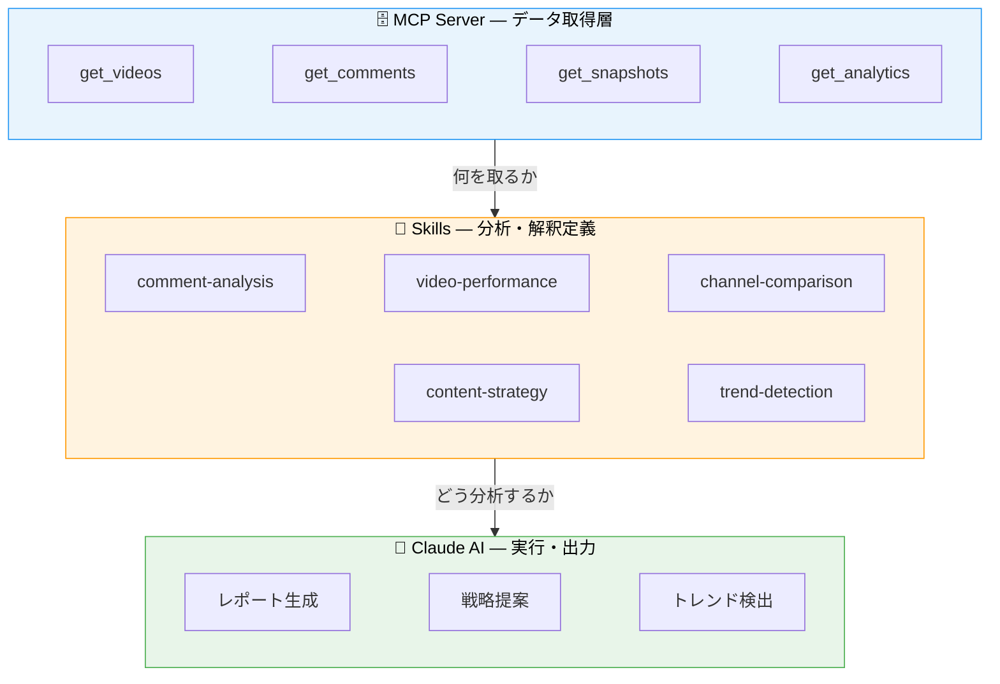

# Samurai Skills Library

YouTube チャンネル運用のための Claude AI スキルライブラリ。
MCP Server で取得したデータに対して、会社として統一された分析観点・出力形式で分析を行う。

## コンセプト



**MCP** がデータの「何を取るか」を担い、**Skills** が「どう分析するか」を定義する。
Claude は Skills に従ってデータを取得・分析し、統一されたフォーマットでレポートを出力する。

## スキル一覧

### YouTube 分析 (自社開発)

MCP Server と連携して YouTube データを分析するスキル。

| スキル | 説明 | 主な用途 |
|---|---|---|
| [comment-analysis](./skills/comment-analysis/) | コメントの感情・テーマ・要望を分析 | 視聴者の声の把握、改善点の発見 |
| [video-performance](./skills/video-performance/) | 動画のパフォーマンスを多角的に分析 | 伸びた動画の要因分析、改善策の提案 |
| [channel-comparison](./skills/channel-comparison/) | チャンネル間の横断比較 | 競合分析、自社チャンネルのポジショニング |
| [content-strategy](./skills/content-strategy/) | データに基づくコンテンツ戦略の策定 | 次の動画企画、投稿スケジュール最適化 |
| [trend-detection](./skills/trend-detection/) | 再生数・エンゲージメントのトレンド検出 | 異常検知、成長チャンネルの早期発見 |

### 開発ツール (Anthropic 公式)

[anthropics/skills](https://github.com/anthropics/skills) および [anthropics/claude-plugins-official](https://github.com/anthropics/claude-plugins-official) から取得。

| スキル | 説明 | ソース |
|---|---|---|
| [skill-creator](./skills/skill-creator/) | 新しいスキルの作成ガイド + 初期化スクリプト | anthropics/skills |
| [mcp-builder](./skills/mcp-builder/) | MCP サーバー構築ガイド (Node.js / Python) | anthropics/skills |
| [code-review](./skills/code-review/) | 5エージェント並列 PR レビュー | claude-plugins-official |
| [pr-review-toolkit](./skills/pr-review-toolkit/) | 6専門エージェントによる包括的 PR レビュー | claude-plugins-official |

### ドキュメント処理 (Anthropic 公式)

| スキル | 説明 | ソース |
|---|---|---|
| [xlsx](./skills/xlsx/) | スプレッドシート作成・編集・分析 | anthropics/skills |
| [pdf](./skills/pdf/) | PDF 結合・分割・抽出・フォーム入力 | anthropics/skills |
| [docx](./skills/docx/) | Word ドキュメント作成・XML 操作 | anthropics/skills |
| [pptx](./skills/pptx/) | プレゼンテーション作成・編集 | anthropics/skills |

## セットアップ

### Claude Code (プロジェクトスキルとして)

```bash
# リポジトリの skills/ を .claude/skills/ にシンボリックリンク
ln -s /path/to/skills-library/skills/comment-analysis .claude/skills/comment-analysis
ln -s /path/to/skills-library/skills/video-performance .claude/skills/video-performance
```

### Claude Code (個人スキルとして)

```bash
# ~/.claude/skills/ に配置すると全プロジェクトで利用可能
ln -s /path/to/skills-library/skills/comment-analysis ~/.claude/skills/comment-analysis
```

### 前提条件

`samurai-youtube` MCP Server が接続済みであること。

```json
{
  "mcpServers": {
    "samurai-youtube": {
      "command": "npx",
      "args": ["-y", "mcp-remote", "https://mcp-server-drab-three.vercel.app/mcp"]
    }
  }
}
```

## スキルの作り方

`_template/` に雛形があります。新しいスキルを作る場合:

1. `skills/<skill-name>/` ディレクトリを作成
2. `SKILL.md` を作成 (YAML frontmatter + Markdown)
3. 必要に応じて `references/`, `examples/`, `scripts/` を追加
4. PR を作成してレビュー

詳細は [_template/SKILL.md](./_template/SKILL.md) を参照。

## 仕様

[Agent Skills Open Standard](https://agentskills.io/specification) に準拠。
Claude Code / Cursor / Gemini CLI / GitHub Copilot で利用可能。
